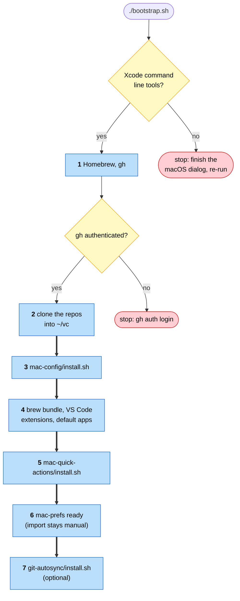

# mac-bootstrap

Bootstrap for a fresh Mac. **Orchestration only**: `bootstrap.sh` checks
preconditions, clones the repositories of the setup into `~/vc`, and calls
their installers. It owns no configuration and no mechanism of its own.

## Run it on a brand-new Mac

You will paste one line three times. The script stops twice — for the two
things no script can do, accepting Apple's developer-tools licence and
proving to GitHub that you are you — and continues from where it stopped.
Budget 20–40 minutes, most of it downloads.

Open Terminal (Spotlight → "Terminal") and paste:

```zsh
curl -fsSL https://raw.githubusercontent.com/tiavelum/mac-bootstrap/main/bootstrap.sh -o $HOME/Downloads/bootstrap.sh && zsh $HOME/Downloads/bootstrap.sh
```

It fetches the current script and runs it; paste the same line each time.
The account must be an administrator (a new Mac's first account is; the
script checks). Append `--dry-run` to see what a run would do without
changing anything.

**Run 1** stops at once: `Xcode command line tools missing`. A macOS dialog
opens (it may be behind the Terminal window). Click **Install**, accept the
licence, wait for the download. Paste the line again.

**Run 2** asks for your Mac password (Homebrew needs it), installs Homebrew
and `gh`, then stops: `Not authenticated with GitHub`. In the same window type
`gh auth login` and answer: **GitHub.com → SSH → Yes, generate a key →**
passphrase (empty on a throwaway machine) **→ Enter for the title → Login
with a web browser**. It prints an eight-character code — **write it down
before pressing Enter**; Safari opens on top of the Terminal. Type the code
into GitHub, Authorize, come back, paste the line a third time.

**Run 3** does everything else and ends with `==> Finished`, the few things
left for a person, and a verify block. Two app installers ask for the
password again on the way; that is all the attention it needs.

**Reading the result.** Every problem is printed with a leading `!!`. None
means the run was clean. Otherwise each line says what to do; fix it and
paste the line once more — the script skips what is already done.

## Run it again later

```zsh
cd $HOME/vc/mac-bootstrap && ./bootstrap.sh     # --dry-run | --skip-transport
```

Idempotent; re-running is how you repair a machine whose wiring drifted.

## The seven stages



Ordered by dependency: `mac-config` is cloned first because every later
stage reads it; the transport comes last because a Mac is fully usable
without it (`--skip-transport` leaves it out). `gh` is installed in stage 1,
ahead of the clones, because the app list lives in a private repo that
cannot be cloned without it. Stage 6 only *prints* the preference-import
command: an import overwrites live settings, so it stays a deliberate act.

## Test it on a throwaway machine

Never on your working Mac — it proves nothing there and can still change
things. Use a macOS guest in UTM (in the Brewfile): **Create a New Virtual
Machine → Virtualize → macOS 12+**, 60 GB, half your RAM, **no shared folder
or clipboard**, a local user, skip iCloud. Then **stop it and Clone it** in
UTM's sidebar — UTM cannot snapshot macOS guests, so the untouched clone
(`clean`) is your reset button: test in the original, delete it when spent,
clone `clean` again.

Run the walkthrough inside the guest. When it breaks: read the `!!` lines,
fix here, push, clone `clean`, run again. Test again whenever this script,
the Brewfile or an installer it calls has changed.

Afterwards revoke what the guest was given: the SSH key titled "GitHub CLI"
under github.com → Settings → SSH and GPG keys, and the device under
Settings → Applications → Authorized GitHub Apps → GitHub CLI.

## The invariant

`bootstrap.sh` contains only preconditions, clones and calls. A step that
needs real work inline belongs in a repo of its own with its own
`install.sh`; this file just calls it.

## `install-log.md`

Append-only record of what was installed on the machine and when. Old rows
are correct as history and stay. Installed something by hand? Add a row,
and declare it in `mac-config` so the next rebuild gets it.
