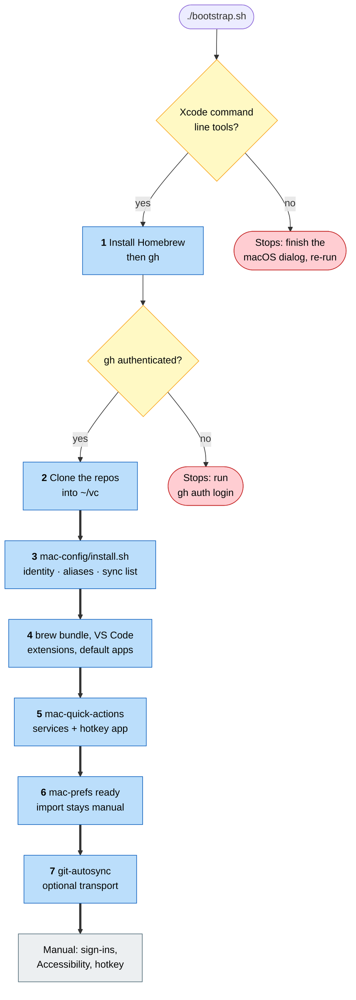

# mac-bootstrap

Bootstrap for a fresh MacBook Air. **Orchestration only** — this repo owns
no configuration and no mechanisms of its own.

## Run it on a brand-new Mac — the walkthrough

You will paste one line three times. The script stops twice, for the two
things no script can do — accept Apple's licence for the developer tools,
and prove to GitHub that you are you — and continues from where it stopped.
Everything else is automatic. Budget 20–40 minutes, most of it downloads.

**Before you start.** A fresh Mac has no `git` and no GitHub login, so this
repository cannot be cloned yet — but it is public and every Mac has `curl`.
Open Terminal (Spotlight → "Terminal") and paste:

```zsh
curl -fsSL https://raw.githubusercontent.com/tiavelum/mac-bootstrap/main/bootstrap.sh -o $HOME/Downloads/bootstrap.sh && zsh $HOME/Downloads/bootstrap.sh
```

That fetches the current script into Downloads and runs it. `$HOME` means
`~` and is on every keyboard. Paste the same line each time: it fetches
again, so a fix pushed between two runs is already in the next one. Append
`--dry-run` to the line to see what a run would do without changing anything.

**Before run 1 — be an administrator.** The account you run this from must be
able to administer the computer; Homebrew needs `sudo`. A new Mac's first
account always is. A second account, or a VM whose setup was clicked through
quickly, may not be — the script checks and says so before doing anything.
System Settings → Users & Groups → ⓘ next to the user → *Allow this user to
administer this computer*, then log out and in.

**Run 1 — the developer tools.** The script stops immediately:
`Xcode command line tools missing`. A macOS dialog opens (if you cannot see
it, it is behind the Terminal window). Click **Install**, accept the licence,
wait — it is a couple of gigabytes. When it says done, paste the same line
again.

**Run 2 — Homebrew, gh, and your login.** The script asks for your Mac
password once — Homebrew needs it, and the script keeps the credential
fresh for the rest of the run so nothing asks again — then installs Homebrew and `gh` with no
further questions, then
stops: `Not authenticated with GitHub`. In the **same** Terminal window,
type:

```zsh
gh auth login
```

Answer the prompts: **GitHub.com** → **SSH** → **Yes**, generate a new key
→ passphrase: on a real Mac give one (it is stored in the keychain, you type
it once); on a throwaway VM leave it empty → title: just press Enter →
**Login with a web browser**.

It then prints an eight-character code — `XXXX-XXXX` — and says *press
Enter to open github.com in your browser*. **Write the code down before you
press Enter.** Safari opens on top of the Terminal and the code stays behind
it. Type the code into the GitHub page, click Authorize, and when it says
"Congratulations, you're all set", go back to Terminal and paste the script
line a third time.

**Run 3 — everything else.** All seven stages, unattended: seven repositories
cloned into `~/vc`, git identity and aliases wired, every app in the Brewfile
installed, Finder actions and the hotkey app built, preferences readied,
sync agents loaded. It ends with `==> Finished`, a list of the sign-ins that
remain, and a short verify block.

**Reading the result.** Every problem the script sees is printed with a
leading `!!`. No `!!` anywhere means the run was clean. If there are some,
each says what to do; fix it and paste the line once more — the script is
safe to repeat, it skips what is already done. A `✘` from `brew bundle` is
usually a download that failed on the vendor's side; the script retries once
and, if it still fails, names it so you can `brew install` it later.

**After it finishes.** The script prints the few things its own stages leave
for a person: the deliberate preference import, and the Accessibility grant
for the hotkey app. Sign-ins and permissions for the apps it installed are
yours to do afterwards.

## Run it again later

```zsh
cd $HOME/vc/mac-bootstrap && ./bootstrap.sh     # --skip-transport to leave stage 7 out
```

Idempotent — re-running is how you repair a machine whose wiring drifted.

## Try it first: `--dry-run`

```zsh
./bootstrap.sh --dry-run
```

Prints every command that would change the machine instead of running it, and
changes nothing — safe on a Mac you care about. The checks still run for real,
so the output shows which stages *would* fire on this machine and which are
already satisfied. On an empty machine it narrates all seven stages; on a
finished one it says "already" at each.

What it cannot tell you: whether the commands *succeed*. For that there is
only one honest test, and it is not this Mac.

## Test it for real: a throwaway machine

The script has to be exercised on a machine that starts from nothing — that is
the only run that tests what it exists for, and the only one that can go wrong
without costing anything. **Never test it on your working Mac**: it would
tell you almost nothing (everything is already there) and it can still change
things (rebuild the hotkey app, upgrade casks).

A macOS virtual machine is the cheapest fresh machine. UTM is in the
Brewfile, so a bootstrapped Mac already has it; otherwise
`brew install --cask utm`.

**Create the guest.** UTM → **Create a New Virtual Machine → Virtualize →
macOS 12+**. It downloads Apple's own recovery image and installs a clean
guest. Give it 60 GB and half your RAM. **Leave sharing off** — no shared
folder, no shared clipboard: a guest that can see your `~/vc` is not a bare
machine, and the test is worthless. First boot walks the normal macOS
setup; make a local user, skip iCloud.

**Clone it before you type anything.** UTM cannot snapshot a macOS guest
(Apple's virtualisation has no snapshots), so the reset button is a copy:
stop the guest, right-click it in UTM's sidebar → **Clone**, and never
touch the clone — call it `clean`. Test in the original; when it is spent,
delete it and clone `clean` again. It is the step that gets skipped, and
without it "start over" means reinstalling macOS, which is an hour, not a
minute. Do it now.

**Run the walkthrough** at the top of this file inside the guest — the one
line, three pastes. `gh auth login` in the guest is a real login
to your real account: browser flow, empty passphrase is fine.

**When it breaks:** read the `!!` lines, fix the script here, push, delete
the spent guest, clone `clean`, run again. That loop is what the clone buys.

**When to test again:** whenever `bootstrap.sh`, the Brewfile, or one of the
installers it calls has changed since the last clean run. A script that
changed is untested again, however small the change looked.

**When you are done, revoke what the guest was given.** `gh auth login` in the
guest uploaded an SSH key to your GitHub account and authorised a device;
deleting the VM does not undo either. Remove the key at github.com →
Settings → SSH and GPG keys (titled "GitHub CLI", dated the day you tested)
and, to be thorough, the device under Settings → Applications → Authorized
GitHub Apps → GitHub CLI. Also note that stage 7 makes the guest's sync
agents live with your credentials: harmless while it has nothing to commit,
but a reason not to leave a test guest running for weeks.

Cheaper still, for the per-user stages only, is a fresh user account on this
Mac (System Settings → Users & Groups). Everything from stage 2 onward is
per-user, so it is a good imitation of a fresh machine — but it shares
Homebrew and the Xcode tools with your account, so it does not test stage 1.

## The seven stages

Two checks that stop the run, then seven stages ordered by dependency. It
orchestrates only: preconditions, clones, and calls into the other repos'
own installers.



1. **Preconditions** — the Xcode command line tools must exist (their
   installer is a GUI dialog; missing, the script says so and stops), then
   Homebrew and `gh` are installed if absent, and `gh auth status` must
   pass — unauthenticated, it prints the login command and exits non-zero.
2. **Clone** every repo of the setup into `~/vc` over SSH, `mac-config`
   first (every later stage reads it) and this repository last; github.com
   is pre-trusted so the first clone does not stop to ask. A failed clone is
   reported, the run continues, and the exit code is non-zero at the end.
3. **Wire the config** — calls `mac-config/install.sh` (identity, aliases,
   sync list; details in that README).
4. **Apps** — `brew bundle` on the Brewfile, retried once for flaky
   downloads; VS Code extensions; then `mac-config/apply-default-apps.sh`.
5. **Tools** — calls `mac-quick-actions/install.sh` (Finder services and
   the hotkey application).
6. **Preferences** — makes the `mac-prefs` scripts executable and prints
   the import command. It never runs it: an import overwrites live
   settings, so it stays a deliberate command.
7. **Transport (optional)** — calls `git-autosync/install.sh` unless
   `--skip-transport`; without it nothing publishes itself.

It ends with what is left for a person and a short verify block.

## The invariant

`bootstrap.sh` contains **only preconditions, clones and calls**. If a step
needs real work inline, it belongs in a repo of its own with its own
`install.sh`, and this file just calls it. That rule is what keeps this repo
from slowly becoming the place where everything lands.

Check it whenever you touch the file: open it and look for a step doing domain
work. There should not be one.

## Why `gh` is installed twice

`gh` is installed directly in stage 1, ahead of every clone, on purpose: the
app list lives in a private repo that cannot be cloned without an
authenticated `gh`. It stays in the Brewfile as well, where it is a no-op on
a machine that already has it.

## `install-log.md`

Chronological journal of what was installed on the machine and when.
Append-only: entries are correct *as history*, so stale paths in old rows
stay. Installed something by hand? Add a row here, and declare it in
`mac-config` so the next rebuild gets it.
